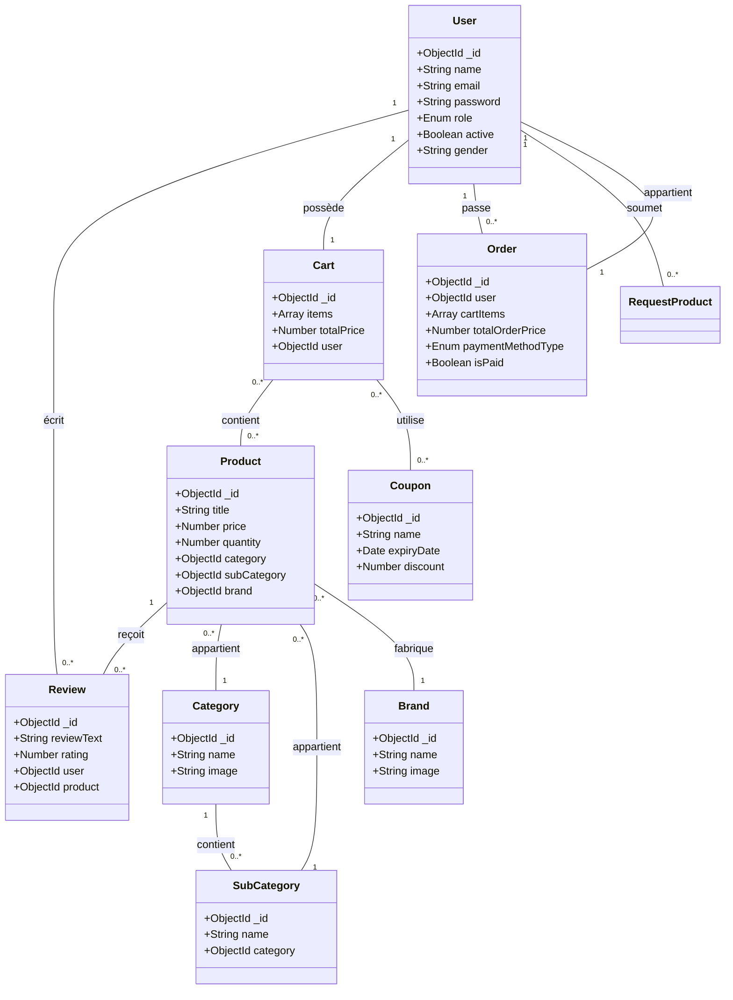

# MShoppy API

## Diagramme UML



## Génération de Ressources

Pour générer une nouvelle ressource complète (Module, Controller, Service, DTO, Entity/Schema) dans ce projet NestJS, vous pouvez utiliser la commande CLI suivante :

```bash
nest g res nom_ressource
```


