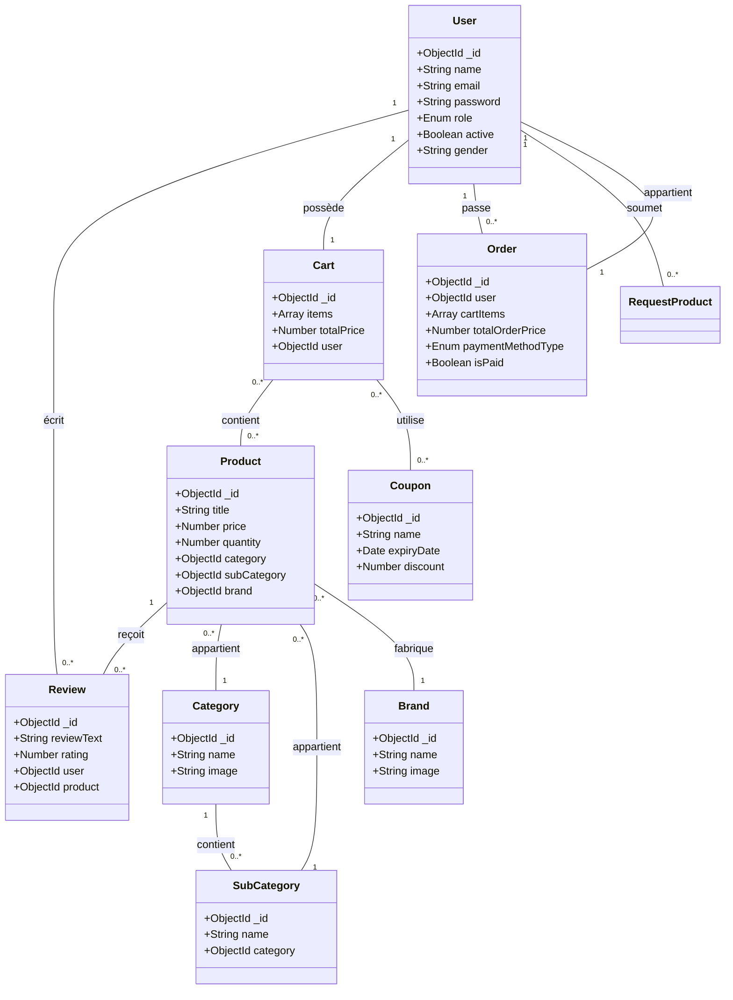

# MShoppy API

## Diagramme UML




## 🛠️ Guide de Création du Projet
### 1. Installation du CLI NestJS
Si ce n'est pas déjà fait, installez l'outil en ligne de commande de NestJS :
```bash
npm i -g @nestjs/cli
```
### 2. Initialisation du projet (Scaffolding)
Création de la structure de base du projet :
```bash
nest new mshoppy-api
```
Cela génère la structure standard (`src/`, `test/`, `node_modules/`, etc.).
### 3. Installation de MongoDB (Mongoose)
Pour connecter l'API à une base de données MongoDB, nous utilisons Mongoose :
```bash
npm install @nestjs/mongoose mongoose
```
### 4. Gestion de la Configuration (.env)
Pour sécuriser les identifiants de connexion, installation du module de configuration :
```bash
npm install @nestjs/config
```
---
*Note : Une fois ces étapes réalisées, le module `MongooseModule` a été configuré dans `app.module.ts` pour utiliser la variable `MONGO_URL` définie dans le fichier `.env`.*

## Génération de Ressources
Pour générer une nouvelle ressource complète (Module, Controller, Service, DTO, Entity/Schema) dans ce projet NestJS, vous pouvez utiliser la commande CLI suivante :

```bash
nest g res nom_ressource
```


